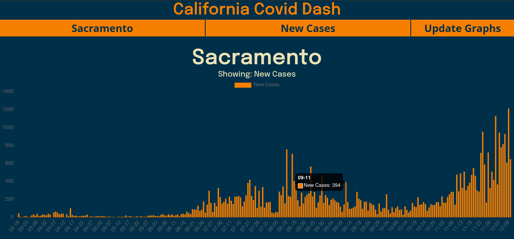

## This project is currently no longer live. After several struggles with an very inconsistent API from the people publishing Covid data on California's Open Data Portal, I have decided to pull the project.

## Description
This is a Covid-19 data dashboard for the state of California, USA. You are able to view data from all 58 counties. This data includes new cases by day, new deaths by day, total cases by day, and total deaths by day.

## Data Sources
~~Data is pulled daily from California's [Open Data Portal](https://data.ca.gov/dataset/590188d5-8545-4c93-a9a0-e230f0db7290/resource/926fd08f-cc91-4828-af38-bd45de97f8c3/download/statewide_cases.csv).~~

## Graphical Demo
~~The application is currently being hosted at [https://coviddash.site](https://coviddash.site).~~

The user will be able to navigate through the different counties in California and view their Covid case and death rates. Filtering data by zip code will be added as a feature in a future version.

